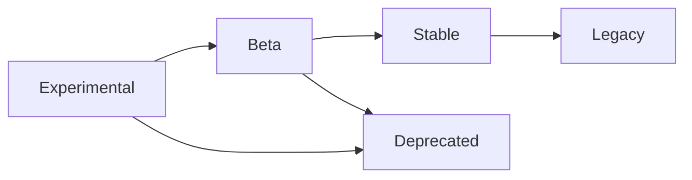

## Overview

WireGuard Easy includes experimental features that are under active development. These features may change or be removed in future releases. Use them with caution in production environments.

<Warning>
  Experimental features are **not guaranteed to be stable** and may:
  - Change behavior in future releases
  - Require migration when promoted to stable features
  - Be removed entirely if development is discontinued
  - Have incomplete documentation or edge cases
</Warning>

## Available Experimental Features

### AmneziaWG Support

<ParamField path="EXPERIMENTAL_AWG" type="boolean" default="false">
  Enable experimental AmneziaWG protocol support.
  
  AmneziaWG is a modified version of WireGuard with enhanced traffic obfuscation capabilities designed to bypass deep packet inspection (DPI) and VPN blocking.
  
  **Status:** Experimental (Planned to be enabled by default in v16)
  
  **Requirements:**
  - AmneziaWG kernel module installed on host system
  - Compatible client applications
  
  **Example:**
  ```yaml
  environment:
    - EXPERIMENTAL_AWG=true
  ```
  
  <Note>
    When enabled, WireGuard Easy will automatically detect if the AmneziaWG kernel module is available and fall back to standard WireGuard if not.
  </Note>
</ParamField>

<ParamField path="OVERRIDE_AUTO_AWG" type="string">
  Force a specific WireGuard implementation when `EXPERIMENTAL_AWG=true`.
  
  By default, WireGuard Easy automatically detects whether to use AmneziaWG or standard WireGuard based on kernel module availability. This variable overrides that detection.
  
  **Possible values:**
  - `awg` - Force AmneziaWG implementation
  - `wg` - Force standard WireGuard implementation
  - Unset (default) - Automatic detection
  
  **Example:**
  ```yaml
  environment:
    - EXPERIMENTAL_AWG=true
    - OVERRIDE_AUTO_AWG=awg
  ```
  
  <Warning>
    Setting this to `awg` without the kernel module installed will cause WireGuard Easy to fail to start.
  </Warning>
</ParamField>

## Detailed Feature Documentation

For comprehensive information about experimental features, see the dedicated documentation pages:

<CardGroup cols={1}>
  <Card title="AmneziaWG Configuration" icon="shield-halved" href="/configuration/amneziawg">
    Complete guide to configuring AmneziaWG including:
    - Installation requirements
    - Environment variable configuration
    - Obfuscation parameters (Jc, Jmin, Jmax, S1-S4, H1-H4)
    - Compatible client applications
    - Troubleshooting
  </Card>
</CardGroup>

## Docker Compose Example

Example configuration with experimental features enabled:

```yaml
volumes:
  etc_wireguard:

services:
  wg-easy:
    image: ghcr.io/wg-easy/wg-easy:15
    container_name: wg-easy
    environment:
      # Standard configuration
      - PORT=51821
      - HOST=0.0.0.0
      - INSECURE=false
      
      # Experimental features
      - EXPERIMENTAL_AWG=true
      # Optional: Force specific implementation
      # - OVERRIDE_AUTO_AWG=awg
    volumes:
      - etc_wireguard:/etc/wireguard
      - /lib/modules:/lib/modules:ro
    ports:
      - "51820:51820/udp"
      - "51821:51821/tcp"
    restart: unless-stopped
    cap_add:
      - NET_ADMIN
      - SYS_MODULE
    sysctls:
      - net.ipv4.ip_forward=1
      - net.ipv4.conf.all.src_valid_mark=1
```

## Migration Path

When experimental features are promoted to stable:

### Version 16 Changes

Starting with WireGuard Easy v16:

- `EXPERIMENTAL_AWG` will be enabled by default
- The variable may be deprecated (automatic AmneziaWG detection will be standard)
- No breaking changes expected for existing configurations

**Recommended action:**

If you're using `EXPERIMENTAL_AWG=true`, you can:
- Keep the variable (it will be ignored in v16+)
- Remove it to clean up your configuration

```yaml
# v15 and earlier
environment:
  - EXPERIMENTAL_AWG=true

# v16 and later (both work the same)
environment:
  # - EXPERIMENTAL_AWG=true  # Optional, can be removed
```

## Best Practices

### Testing Experimental Features

1. **Test in Non-Production First**
   ```yaml
   # Create a separate test instance
   services:
     wg-easy-test:
       image: ghcr.io/wg-easy/wg-easy:15
       environment:
         - EXPERIMENTAL_AWG=true
         - PORT=51822  # Different port
   ```

2. **Monitor Logs**
   ```bash
   docker logs -f wg-easy
   ```
   Look for warnings or errors related to experimental features.

3. **Have a Rollback Plan**
   - Keep backups of your `/etc/wireguard` volume
   - Document your configuration
   - Test rollback procedures

### Monitoring Feature Status

Check the [WireGuard Easy changelog](https://github.com/wg-easy/wg-easy/releases) for:
- Feature stability updates
- Migration guides
- Deprecation notices
- Breaking changes

## Feature Lifecycle

Experimental features typically follow this lifecycle:



1. **Experimental** - Initial development, requires opt-in
2. **Beta** - More stable, may be enabled by default
3. **Stable** - Production-ready, fully supported
4. **Deprecated** - Scheduled for removal
5. **Legacy** - Maintained for backward compatibility

## Reporting Issues

When reporting issues with experimental features:

1. **Include Configuration**
   ```yaml
   environment:
     - EXPERIMENTAL_AWG=true
     - DEBUG=Server,WireGuard,Database,CMD
   ```

2. **Provide Logs**
   ```bash
   docker logs wg-easy > wg-easy-logs.txt
   ```

3. **Specify Version**
   ```bash
   docker inspect wg-easy | grep -i version
   ```

4. **Describe Expected vs Actual Behavior**

Submit issues to: [https://github.com/wg-easy/wg-easy/issues](https://github.com/wg-easy/wg-easy/issues)

## Future Experimental Features

Potential future experimental features (not yet available):

<Note>
  This is a preview of potential features under consideration. They are not currently implemented.
</Note>

- Advanced traffic shaping
- Multi-factor authentication methods
- Additional VPN protocols
- Enhanced monitoring and metrics
- Custom plugin system

Stay updated by watching the [GitHub repository](https://github.com/wg-easy/wg-easy) and checking release notes.

## Related Documentation

<CardGroup cols={2}>
  <Card title="Environment Variables" icon="sliders" href="/configuration/environment-variables">
    Complete environment variable reference
  </Card>
  <Card title="AmneziaWG" icon="shield-halved" href="/configuration/amneziawg">
    Detailed AmneziaWG configuration guide
  </Card>
</CardGroup>
