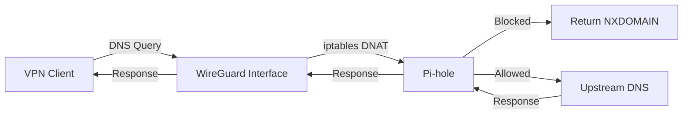

This guide demonstrates how to integrate WireGuard Easy with Pi-hole to provide comprehensive DNS-based ad-blocking and tracking protection for all your VPN clients.

## Overview

Pi-hole is a network-level advertisement and internet tracker blocking application. When integrated with WireGuard Easy, it provides:

- Network-wide ad blocking without client-side software
- Protection against tracking and malicious domains
- Detailed DNS query analytics and statistics
- Custom DNS filtering with whitelist/blacklist support
- Local DNS records for home network devices
- DHCP server capabilities (optional)

## Prerequisites

Before starting, ensure you have:

- A working WireGuard Easy installation
- Docker and Docker Compose installed
- Basic understanding of Docker networking
- At least 2GB RAM on your host system
- (Optional) A reverse proxy for secure web access

## Architecture

The integration architecture consists of:

1. **WireGuard Easy**: VPN server managing client connections
2. **Pi-hole**: DNS server providing ad-blocking and filtering
3. **Shared Docker Network**: Both containers communicate via a bridge network
4. **DNS Redirection**: iptables rules force all DNS traffic through Pi-hole
5. **Upstream DNS**: Pi-hole forwards clean queries to upstream resolvers

## Installation Steps

<Steps>

### Create Pi-hole directory structure

Set up the necessary directories for Pi-hole data and configuration:

```bash
sudo mkdir -p /etc/docker/containers/pihole
sudo mkdir -p /etc/docker/volumes/pihole/etc-pihole
sudo mkdir -p /etc/docker/volumes/pihole/etc-dnsmasq.d
```

### Create shared Docker network

Create a dedicated network for container communication:

```bash
sudo docker network create --subnet=10.42.42.0/24 --ipv6 --subnet=fdcc:ad94:bacf:61a3::/64 wg
```

<Note>
If the network already exists from a previous setup, you can skip this step or remove the existing network first with `sudo docker network rm wg`.
</Note>

### Configure Pi-hole

Create the Docker Compose configuration for Pi-hole:

**File: `/etc/docker/containers/pihole/docker-compose.yml`**

```yaml
services:
  pihole:
    image: pihole/pihole:latest
    container_name: pihole
    restart: unless-stopped
    hostname: pihole
    environment:
      # Timezone - adjust to your location
      TZ: 'America/New_York'
      
      # Web interface password
      WEBPASSWORD: 'your-secure-password'
      
      # DNS settings
      PIHOLE_DNS_: '1.1.1.1;8.8.8.8'
      
      # Web interface settings
      VIRTUAL_HOST: 'pihole.local'
      
      # IPv6 support
      IPv6: 'true'
      
      # Interface listening behavior
      DNSMASQ_LISTENING: 'all'
      
      # Web server port (if using reverse proxy)
      WEB_PORT: '80'
      
    volumes:
      - /etc/docker/volumes/pihole/etc-pihole:/etc/pihole
      - /etc/docker/volumes/pihole/etc-dnsmasq.d:/etc/dnsmasq.d
    
    # Cap drop for security
    cap_add:
      - NET_ADMIN
    
    networks:
      wg:
        ipv4_address: 10.42.42.53
        ipv6_address: fdcc:ad94:bacf:61a3::53

networks:
  wg:
    external: true
```

<Info>
**Port Configuration**: This configuration doesn't expose ports to the host. Pi-hole is only accessible via the Docker network and optionally through a reverse proxy. If you need direct host access, add:
```yaml
ports:
  - "8080:80/tcp"    # Web interface
  - "53:53/tcp"      # DNS
  - "53:53/udp"      # DNS
```
</Info>

### Update WireGuard Easy configuration

Modify your WireGuard Easy setup to use Pi-hole for DNS:

**File: `/etc/docker/containers/wg-easy/docker-compose.yml`**

```yaml
services:
  wg-easy:
    image: ghcr.io/wg-easy/wg-easy:latest
    container_name: wg-easy
    restart: unless-stopped
    
    ports:
      - "51820:51820/udp"
      - "51821:51821/tcp"
    
    cap_add:
      - NET_ADMIN
      - SYS_MODULE
    
    sysctls:
      - net.ipv4.ip_forward=1
      - net.ipv4.conf.all.src_valid_mark=1
      - net.ipv6.conf.all.forwarding=1
      - net.ipv6.conf.default.forwarding=1
    
    volumes:
      - /etc/docker/volumes/wg-easy:/etc/wireguard
    
    networks:
      wg:
        ipv4_address: 10.42.42.2
        ipv6_address: fdcc:ad94:bacf:61a3::2
    
    environment:
      # Basic Configuration
      - WG_HOST=vpn.example.com
      - PASSWORD=your-admin-password
      
      # DNS Configuration - Point to Pi-hole
      - WG_DEFAULT_DNS=10.42.42.53,fdcc:ad94:bacf:61a3::53
      
      # Network Configuration
      - WG_ALLOWED_IPS=0.0.0.0/0,::/0
      - WG_PORT=51820
      
      # Client Configuration
      - WG_PERSISTENT_KEEPALIVE=25
      - WG_MTU=1420

networks:
  wg:
    external: true
```

### Configure DNS traffic redirection

Access the WireGuard Easy web interface and set up hooks to redirect DNS traffic:

1. Navigate to **Admin → Hooks**
2. Configure the following hooks:

**PostUp Hook:**

```bash
iptables -A INPUT -p udp -m udp --dport {{port}} -j ACCEPT; ip6tables -A INPUT -p udp -m udp --dport {{port}} -j ACCEPT; iptables -t nat -A PREROUTING -i wg0 -p udp --dport 53 -j DNAT --to-destination 10.42.42.53; iptables -t nat -A PREROUTING -i wg0 -p tcp --dport 53 -j DNAT --to-destination 10.42.42.53; ip6tables -t nat -A PREROUTING -i wg0 -p udp --dport 53 -j DNAT --to-destination fdcc:ad94:bacf:61a3::53; ip6tables -t nat -A PREROUTING -i wg0 -p tcp --dport 53 -j DNAT --to-destination fdcc:ad94:bacf:61a3::53; iptables -A FORWARD -i wg0 -j ACCEPT; iptables -A FORWARD -o wg0 -j ACCEPT; ip6tables -A FORWARD -i wg0 -j ACCEPT; ip6tables -A FORWARD -o wg0 -j ACCEPT; iptables -t nat -A POSTROUTING -s {{ipv4Cidr}} -o {{device}} -j MASQUERADE; ip6tables -t nat -A POSTROUTING -s {{ipv6Cidr}} -o {{device}} -j MASQUERADE;
```

**PostDown Hook:**

```bash
iptables -D INPUT -p udp -m udp --dport {{port}} -j ACCEPT || true; ip6tables -D INPUT -p udp -m udp --dport {{port}} -j ACCEPT || true; iptables -t nat -D PREROUTING -i wg0 -p udp --dport 53 -j DNAT --to-destination 10.42.42.53 || true; iptables -t nat -D PREROUTING -i wg0 -p tcp --dport 53 -j DNAT --to-destination 10.42.42.53 || true; ip6tables -t nat -D PREROUTING -i wg0 -p udp --dport 53 -j DNAT --to-destination fdcc:ad94:bacf:61a3::53 || true; ip6tables -t nat -D PREROUTING -i wg0 -p tcp --dport 53 -j DNAT --to-destination fdcc:ad94:bacf:61a3::53 || true; iptables -D FORWARD -i wg0 -j ACCEPT || true; iptables -D FORWARD -o wg0 -j ACCEPT || true; ip6tables -D FORWARD -i wg0 -j ACCEPT || true; ip6tables -D FORWARD -o wg0 -j ACCEPT || true; iptables -t nat -D POSTROUTING -s {{ipv4Cidr}} -o {{device}} -j MASQUERADE || true; ip6tables -t nat -D POSTROUTING -s {{ipv6Cidr}} -o {{device}} -j MASQUERADE || true;
```

<Warning>
**DNS Leak Prevention**: These hooks ensure that ALL DNS traffic from VPN clients is routed through Pi-hole, preventing DNS leaks even if clients try to use alternative DNS servers.
</Warning>

### Deploy the services

Start both services and verify they're running:

```bash
# Start Pi-hole
cd /etc/docker/containers/pihole
sudo docker compose up -d

# Wait for Pi-hole to fully initialize (about 30 seconds)
sleep 30

# Restart WireGuard Easy to apply changes
cd /etc/docker/containers/wg-easy
sudo docker compose down
sudo docker compose up -d

# Verify both containers are running
sudo docker ps | grep -E 'pihole|wg-easy'
```

### Access and configure Pi-hole

Access the Pi-hole admin interface:

1. Navigate to `http://<your-server-ip>:8080/admin` (if you exposed the port)
2. Or access via the internal network: `http://10.42.42.53/admin`
3. Log in with the password set in `WEBPASSWORD`
4. Complete the initial setup if prompted

**Recommended initial configuration:**

1. Go to **Settings → DNS**:
   - Select your preferred upstream DNS servers
   - Enable "Use DNSSEC"
   - Consider enabling "Use Conditional Forwarding" for local network

2. Go to **Settings → Blocklists**:
   - Default lists are enabled
   - Add additional blocklists if desired
   - Click "Update Gravity" to apply

3. Go to **Settings → System**:
   - Review and adjust query logging settings
   - Set API/Web interface settings

</Steps>

## Network Configuration Details

### IP Addressing Scheme

| Service | IPv4 Address | IPv6 Address | Purpose |
|---------|--------------|---------------|----------|
| WireGuard Easy | 10.42.42.2 | fdcc:ad94:bacf:61a3::2 | VPN gateway |
| Pi-hole | 10.42.42.53 | fdcc:ad94:bacf:61a3::53 | DNS server |
| Docker Network | 10.42.42.0/24 | fdcc:ad94:bacf:61a3::/64 | Container subnet |

<Info>
The Pi-hole IP address ends in `.53` (the DNS port number) for easy memorization, but you can use any available address in the subnet.
</Info>

### DNS Query Flow



1. **Client Request**: VPN client sends DNS query
2. **Traffic Interception**: iptables DNAT rule intercepts port 53 traffic
3. **Pi-hole Processing**: Query checked against blocklists
4. **Blocked Domains**: Return NXDOMAIN or custom block page
5. **Allowed Domains**: Forward to upstream DNS servers
6. **Response**: Answer returned to client through reverse path

## Verification

### Test ad-blocking functionality

From a connected VPN client:

```bash
# Test normal DNS resolution (should work)
nslookup google.com

# Test ad domain blocking (should be blocked)
nslookup ads.google.com
nslookup doubleclick.net

# Visual test - visit these URLs in browser:
# http://pi.hole/admin (should show Pi-hole admin)
# https://www.speedtest.net (ads should be blocked)
```

### Verify DNS traffic in Pi-hole

1. Open Pi-hole admin interface
2. Navigate to **Dashboard**
3. You should see:
   - Queries from VPN client IPs (10.8.0.x range)
   - Blocked queries count increasing
   - Top blocked domains list

4. Go to **Tools → Query Log**:
   - See real-time DNS queries
   - Verify queries are coming from VPN clients
   - Check that ads are being blocked (red status)

### Check container connectivity

```bash
# Verify containers are on same network
sudo docker network inspect wg | grep -A 5 'Containers'

# Test connectivity from WireGuard to Pi-hole
sudo docker exec wg-easy ping -c 3 10.42.42.53

# Test DNS resolution from WireGuard container
sudo docker exec wg-easy nslookup google.com 10.42.42.53

# Check iptables rules are active
sudo docker exec wg-easy iptables -t nat -L PREROUTING -n -v | grep 53
```

### Verify DNS leak protection

From VPN client, use online tools:

- Visit https://dnsleaktest.com
- Run extended test
- All DNS queries should go through your Pi-hole server's ISP
- No third-party DNS servers should be detected

## Optimization

### Pi-hole performance tuning

Create a custom dnsmasq configuration:

**File: `/etc/docker/volumes/pihole/etc-dnsmasq.d/99-custom.conf`**

```conf
# Increase DNS cache size (default is 10000)
cache-size=50000

# Increase maximum TTL
max-ttl=86400

# Minimum cache time
min-cache-ttl=3600

# Enable DNSSEC
dnssec

# Don't read /etc/resolv.conf
no-resolv

# Improve performance for large blocklists
no-negcache

# Reduce memory usage
filter-aaaa
```

Restart Pi-hole to apply:

```bash
sudo docker restart pihole
```

### System-level optimizations

Increase file descriptors and connection limits:

**File: `/etc/sysctl.d/99-pihole.conf`**

```bash
# Increase connection tracking
net.netfilter.nf_conntrack_max = 262144

# Improve DNS performance
net.core.netdev_max_backlog = 5000
net.core.rmem_default = 262144
net.core.rmem_max = 16777216
net.core.wmem_default = 262144
net.core.wmem_max = 16777216

# Reduce TIME_WAIT sockets
net.ipv4.tcp_fin_timeout = 15
net.ipv4.tcp_tw_reuse = 1
```

Apply changes:

```bash
sudo sysctl --system
```

### Blocklist optimization

**Recommended blocklists** (add in Pi-hole → Settings → Blocklists):

```
https://raw.githubusercontent.com/StevenBlack/hosts/master/hosts
https://v.firebog.net/hosts/AdguardDNS.txt
https://v.firebog.net/hosts/Easylist.txt
https://raw.githubusercontent.com/crazy-max/WindowsSpyBlocker/master/data/hosts/spy.txt
```

After adding, update gravity:

```bash
sudo docker exec pihole pihole -g
```

## Reverse Proxy Integration

### With Traefik

Add Traefik labels to your Pi-hole service:

```yaml
services:
  pihole:
    # ... existing configuration ...
    networks:
      wg:
        ipv4_address: 10.42.42.53
        ipv6_address: fdcc:ad94:bacf:61a3::53
      traefik:
    labels:
      - "traefik.enable=true"
      - "traefik.http.routers.pihole.rule=Host(`pihole.example.com`)"
      - "traefik.http.routers.pihole.entrypoints=websecure"
      - "traefik.http.routers.pihole.service=pihole"
      - "traefik.http.services.pihole.loadbalancer.server.port=80"
      - "traefik.docker.network=traefik"
      # Optional: Add path prefix middleware
      - "traefik.http.routers.pihole.middlewares=pihole-addprefix"
      - "traefik.http.middlewares.pihole-addprefix.addPrefix.prefix=/admin"

networks:
  wg:
    external: true
  traefik:
    external: true
```

### With Caddy

Add to your Caddyfile:

```caddy
pihole.example.com {
    reverse_proxy pihole:80
    
    # Optional: redirect root to /admin
    redir / /admin
    
    # Optional: basic auth
    basicauth /admin/* {
        username $2a$14$...
    }
}
```

### With Nginx

Create an Nginx configuration:

```nginx
server {
    listen 443 ssl http2;
    server_name pihole.example.com;
    
    ssl_certificate /path/to/cert.pem;
    ssl_certificate_key /path/to/key.pem;
    
    location / {
        proxy_pass http://10.42.42.53:80;
        proxy_set_header Host $host;
        proxy_set_header X-Real-IP $remote_addr;
        proxy_set_header X-Forwarded-For $proxy_add_x_forwarded_for;
        proxy_set_header X-Forwarded-Proto $scheme;
    }
}
```

## Troubleshooting

### Ads not being blocked

**Symptom**: Connected to VPN but ads still appear.

**Diagnosis steps**:

1. Check if Pi-hole is receiving queries:
   ```bash
   sudo docker exec pihole pihole -c -e
   ```

2. Verify iptables rules:
   ```bash
   sudo docker exec wg-easy iptables -t nat -L PREROUTING -n -v
   ```

3. Test DNS from WireGuard container:
   ```bash
   sudo docker exec wg-easy nslookup doubleclick.net 10.42.42.53
   ```

**Solutions**:

1. **Update gravity database**:
   ```bash
   sudo docker exec pihole pihole -g
   ```

2. **Check blocklists are enabled**:
   - Open Pi-hole admin → Settings → Blocklists
   - Ensure lists are checked and updated recently

3. **Verify client DNS settings**:
   - Download WireGuard config from wg-easy
   - Check `DNS = 10.42.42.53, fdcc:ad94:bacf:61a3::53`

4. **Flush DNS cache** on client:
   - Windows: `ipconfig /flushdns`
   - macOS: `sudo dscacheutil -flushcache`
   - Linux: `sudo systemd-resolve --flush-caches`

### Pi-hole web interface not accessible

**Symptom**: Cannot access Pi-hole admin panel.

**Solutions**:

1. **Check container status**:
   ```bash
   sudo docker ps | grep pihole
   sudo docker logs pihole --tail 50
   ```

2. **Verify password is set**:
   ```bash
   sudo docker exec pihole pihole -a -p
   # Enter new password when prompted
   ```

3. **Check lighttpd is running**:
   ```bash
   sudo docker exec pihole pgrep lighttpd
   ```

4. **Restart Pi-hole**:
   ```bash
   sudo docker restart pihole
   ```

5. **Check firewall rules** (if accessing from host):
   ```bash
   sudo iptables -L -n | grep 8080
   ```

### DNS resolution extremely slow

**Symptom**: Web pages take long time to load, DNS timeouts.

**Diagnosis**:

```bash
# Test DNS response time
time sudo docker exec pihole dig @127.0.0.1 google.com

# Check Pi-hole CPU usage
sudo docker stats pihole --no-stream

# Check upstream DNS performance
sudo docker exec pihole pihole -d
```

**Solutions**:

1. **Reduce blocklist count**:
   - Too many blocklists can slow down Pi-hole
   - Aim for 500K-1M blocked domains max
   - Remove duplicate or overlapping lists

2. **Change upstream DNS servers**:
   ```bash
   # Edit Pi-hole config
   sudo docker exec pihole nano /etc/pihole/setupVars.conf
   # Set PIHOLE_DNS_1=1.1.1.1
   # Set PIHOLE_DNS_2=8.8.8.8
   sudo docker restart pihole
   ```

3. **Increase cache size** (see Optimization section)

4. **Check disk I/O**:
   ```bash
   iostat -x 1
   ```

5. **Allocate more resources** to Docker container:
   ```yaml
   services:
     pihole:
       deploy:
         resources:
           limits:
             cpus: '2'
             memory: 512M
   ```

### VPN clients lose internet connectivity

**Symptom**: Connected to VPN but can't browse websites.

**Diagnosis**:

```bash
# From VPN client, test:
ping 8.8.8.8              # Test basic connectivity
nslookup google.com       # Test DNS resolution
ping google.com           # Test end-to-end connectivity

# From server:
sudo docker exec wg-easy wg show
sudo docker exec wg-easy iptables -L -n -v | grep FORWARD
```

**Solutions**:

1. **Verify IP forwarding**:
   ```bash
   sudo docker exec wg-easy sysctl net.ipv4.ip_forward
   # Should be: net.ipv4.ip_forward = 1
   ```

2. **Check MASQUERADE rules**:
   ```bash
   sudo docker exec wg-easy iptables -t nat -L POSTROUTING -n -v
   # Should see MASQUERADE rule for 10.8.0.0/24
   ```

3. **Restart both services**:
   ```bash
   sudo docker restart pihole wg-easy
   ```

4. **Check Pi-hole is responding**:
   ```bash
   sudo docker exec pihole pihole status
   ```

### Pi-hole database corruption

**Symptom**: Pi-hole crashes, query log shows errors, gravity update fails.

**Solutions**:

1. **Check database integrity**:
   ```bash
   sudo docker exec pihole pihole -d
   ```

2. **Repair database**:
   ```bash
   sudo docker exec pihole sqlite3 /etc/pihole/pihole-FTL.db "PRAGMA integrity_check"
   sudo docker exec pihole sqlite3 /etc/pihole/gravity.db "PRAGMA integrity_check"
   ```

3. **Rebuild gravity database**:
   ```bash
   sudo docker exec pihole pihole -g
   ```

4. **Full reset** (last resort):
   ```bash
   sudo docker compose down
   sudo rm -rf /etc/docker/volumes/pihole/etc-pihole/*
   sudo docker compose up -d
   # Reconfigure Pi-hole through web interface
   ```

### IPv6 issues

**Symptom**: IPv6 websites don't load or DNS over IPv6 fails.

**Solutions**:

1. **Enable IPv6 in Pi-hole**:
   - Settings → System → Enable IPv6
   - Restart DNS resolver

2. **Check IPv6 forwarding**:
   ```bash
   sudo sysctl net.ipv6.conf.all.forwarding
   # Should return: 1
   ```

3. **Verify IPv6 upstream DNS**:
   ```bash
   sudo docker exec pihole cat /etc/pihole/setupVars.conf | grep IPV6
   ```

4. **Test IPv6 connectivity**:
   ```bash
   sudo docker exec pihole ping6 -c 3 google.com
   sudo docker exec wg-easy ping6 -c 3 fdcc:ad94:bacf:61a3::53
   ```

### High memory usage

**Symptom**: Pi-hole container consuming excessive RAM.

**Solutions**:

1. **Check memory usage**:
   ```bash
   sudo docker stats pihole --no-stream
   ```

2. **Reduce cache size**:
   ```conf
   # In /etc/docker/volumes/pihole/etc-dnsmasq.d/99-custom.conf
   cache-size=10000
   ```

3. **Disable query logging** temporarily:
   ```bash
   sudo docker exec pihole pihole logging off
   ```

4. **Clear old logs**:
   ```bash
   sudo docker exec pihole pihole -f
   ```

5. **Set memory limit** in docker-compose:
   ```yaml
   services:
     pihole:
       mem_limit: 512m
   ```

## Advanced Configuration

### Local DNS records

Add custom DNS entries for local services:

**Method 1: Via Web Interface**

1. Go to **Local DNS → DNS Records**
2. Add entries:
   - Domain: `server.local`
   - IP Address: `192.168.1.100`

**Method 2: Via Configuration File**

```bash
sudo docker exec pihole sh -c 'echo "192.168.1.100 server.local" >> /etc/pihole/custom.list'
sudo docker exec pihole pihole restartdns
```

### CNAME records

Create CNAME records for multiple domain names:

**File: `/etc/docker/volumes/pihole/etc-dnsmasq.d/05-cnames.conf`**

```conf
cname=service1.local,server.local
cname=service2.local,server.local
cname=*.apps.local,server.local
```

Restart Pi-hole:

```bash
sudo docker restart pihole
```

### Conditional forwarding

Forward local domain queries to your router:

1. Go to **Settings → DNS → Advanced DNS settings**
2. Enable "Conditional forwarding"
3. Set:
   - Local network in CIDR: `192.168.1.0/24`
   - IP address of DHCP server (router): `192.168.1.1`
   - Local domain name: `home.local`

### Whitelist/Blacklist management

**Whitelist a domain** (allow it to resolve):

```bash
# Via command line
sudo docker exec pihole pihole -w example.com

# Via web interface
# Domains → Whitelist → Add domain
```

**Blacklist a domain** (block it):

```bash
# Via command line
sudo docker exec pihole pihole -b ads.example.com

# Via regex (more powerful)
sudo docker exec pihole pihole -regex '(^|\.)example\.com$'
```

**Bulk import**:

```bash
# Create file with domains
cat > /tmp/whitelist.txt << EOF
good-domain1.com
good-domain2.com
EOF

# Import
sudo docker exec -i pihole sh -c 'while read domain; do pihole -w $domain; done' < /tmp/whitelist.txt
```

### Group management

Assign different clients to different filtering groups:

1. **Create groups**:
   - Go to **Group Management → Groups**
   - Add groups: "Kids", "Adults", "IoT"

2. **Assign clients to groups**:
   - Go to **Group Management → Clients**
   - Add client IP addresses from VPN subnet
   - Assign to appropriate groups

3. **Configure group-specific blocklists**:
   - Go to **Group Management → Adlists**
   - Assign blocklists to specific groups

### API integration

Pi-hole provides a RESTful API for automation:

**Get statistics**:

```bash
curl -X GET "http://10.42.42.53/admin/api.php?summary&auth=YOUR_API_KEY"
```

**Get API key**:

```bash
sudo docker exec pihole cat /etc/pihole/setupVars.conf | grep WEBPASSWORD
```

**Enable/disable blocking**:

```bash
# Disable for 60 seconds
sudo docker exec pihole pihole disable 60

# Re-enable
sudo docker exec pihole pihole enable
```

## Complete Docker Compose Example

Comprehensive example with WireGuard Easy, Pi-hole, and Traefik:

```yaml
# File: /etc/docker/containers/vpn-stack/docker-compose.yml

services:
  wg-easy:
    image: ghcr.io/wg-easy/wg-easy:latest
    container_name: wg-easy
    restart: unless-stopped
    ports:
      - "51820:51820/udp"
    cap_add:
      - NET_ADMIN
      - SYS_MODULE
    sysctls:
      - net.ipv4.ip_forward=1
      - net.ipv4.conf.all.src_valid_mark=1
      - net.ipv6.conf.all.forwarding=1
    volumes:
      - ./wg-easy:/etc/wireguard
    networks:
      wg:
        ipv4_address: 10.42.42.2
        ipv6_address: fdcc:ad94:bacf:61a3::2
      traefik:
    environment:
      - WG_HOST=vpn.example.com
      - PASSWORD=your-secure-password
      - WG_DEFAULT_DNS=10.42.42.53,fdcc:ad94:bacf:61a3::53
      - WG_ALLOWED_IPS=0.0.0.0/0,::/0
      - WG_PORT=51820
    labels:
      - "traefik.enable=true"
      - "traefik.http.routers.wg-easy.rule=Host(`vpn.example.com`)"
      - "traefik.http.routers.wg-easy.entrypoints=websecure"
      - "traefik.http.services.wg-easy.loadbalancer.server.port=51821"
      - "traefik.docker.network=traefik"

  pihole:
    image: pihole/pihole:latest
    container_name: pihole
    restart: unless-stopped
    hostname: pihole
    environment:
      TZ: 'America/New_York'
      WEBPASSWORD: 'your-pihole-password'
      PIHOLE_DNS_: '1.1.1.1;8.8.8.8'
      IPv6: 'true'
      DNSMASQ_LISTENING: 'all'
    volumes:
      - ./pihole/etc-pihole:/etc/pihole
      - ./pihole/etc-dnsmasq.d:/etc/dnsmasq.d
    cap_add:
      - NET_ADMIN
    networks:
      wg:
        ipv4_address: 10.42.42.53
        ipv6_address: fdcc:ad94:bacf:61a3::53
      traefik:
    labels:
      - "traefik.enable=true"
      - "traefik.http.routers.pihole.rule=Host(`pihole.example.com`)"
      - "traefik.http.routers.pihole.entrypoints=websecure"
      - "traefik.http.services.pihole.loadbalancer.server.port=80"
      - "traefik.docker.network=traefik"
    depends_on:
      - wg-easy

networks:
  wg:
    name: wg
    ipam:
      driver: default
      config:
        - subnet: 10.42.42.0/24
        - subnet: fdcc:ad94:bacf:61a3::/64
  traefik:
    external: true
```

## Security Best Practices

1. **Strong passwords**:
   - Use unique, complex passwords for both Pi-hole and WireGuard
   - Consider using a password manager

2. **Regular updates**:
   ```bash
   cd /etc/docker/containers/pihole
   sudo docker compose pull
   sudo docker compose up -d
   ```

3. **Query logging privacy**:
   - Consider disabling query logging for privacy
   - Or set short retention periods
   - Settings → Privacy → Set to "Anonymous mode"

4. **HTTPS for admin interface**:
   - Always use reverse proxy with TLS
   - Never expose Pi-hole directly to internet

5. **Rate limiting**:
   - Prevent DNS amplification attacks
   - Configure in dnsmasq: `dns-ratelimit=1000,10`

6. **Firewall rules**:
   ```bash
   # Only allow WireGuard port from outside
   sudo ufw allow 51820/udp
   sudo ufw deny 53
   sudo ufw deny 80
   ```

## Monitoring and Maintenance

### Query statistics

View real-time statistics:

```bash
# Command line stats
sudo docker exec pihole pihole -c

# Top domains
sudo docker exec pihole pihole -t

# Top blocked domains
sudo docker exec pihole pihole -q
```

### Health checks

Create a health check script:

**File: `/usr/local/bin/check-pihole.sh`**

```bash
#!/bin/bash

# Check if Pi-hole is responding
if ! docker exec pihole pihole status &>/dev/null; then
    echo "Pi-hole is not responding, restarting..."
    docker restart pihole
    # Send alert (optional)
    # curl -X POST https://your-alert-service.com/alert
fi

# Check if gravity database is recent
GRAVITY_AGE=$(docker exec pihole find /etc/pihole/gravity.db -mtime +7)
if [ -n "$GRAVITY_AGE" ]; then
    echo "Gravity database is old, updating..."
    docker exec pihole pihole -g
fi
```

Add to crontab:

```bash
# Check every 5 minutes
*/5 * * * * /usr/local/bin/check-pihole.sh
```

### Backup and restore

**Backup Pi-hole configuration**:

```bash
#!/bin/bash
BACKUP_DIR="/backup/pihole"
mkdir -p $BACKUP_DIR

# Backup teleporter (all settings)
sudo docker exec pihole pihole -a -t > "$BACKUP_DIR/pihole-backup-$(date +%Y%m%d).tar.gz"

# Backup volumes
sudo tar -czf "$BACKUP_DIR/pihole-volumes-$(date +%Y%m%d).tar.gz" /etc/docker/volumes/pihole/

# Keep only last 7 days
find $BACKUP_DIR -name "pihole-*.tar.gz" -mtime +7 -delete
```

**Restore from backup**:

```bash
# Stop Pi-hole
sudo docker compose down

# Restore volumes
sudo tar -xzf pihole-volumes-YYYYMMDD.tar.gz -C /

# Start Pi-hole
sudo docker compose up -d

# Or use teleporter through web interface:
# Settings → Teleporter → Restore
```

### Log rotation

Pi-hole automatically rotates logs, but you can configure it:

**File: `/etc/docker/volumes/pihole/etc-dnsmasq.d/06-logs.conf`**

```conf
# Limit log size
log-queries
log-facility=/var/log/pihole.log

# Rotate after 10MB
log-async=50
```

### Update automation

Automate updates with a script:

```bash
#!/bin/bash
# File: /usr/local/bin/update-pihole.sh

cd /etc/docker/containers/pihole
sudo docker compose pull
sudo docker compose up -d
sudo docker exec pihole pihole -up

echo "Pi-hole updated: $(date)" >> /var/log/pihole-updates.log
```

Schedule weekly:

```bash
# Run every Sunday at 3 AM
0 3 * * 0 /usr/local/bin/update-pihole.sh
```

## Migration from Other DNS Solutions

### From AdGuard Home

1. Export AdGuard Home configuration
2. Manually recreate custom DNS entries in Pi-hole
3. Import blocklists (most are compatible)
4. Update WireGuard DNS settings
5. Test thoroughly before decommissioning AdGuard

### From Unbound

1. Note all custom DNS zones
2. Configure Pi-hole with same upstream resolvers
3. Recreate local zones in Pi-hole
4. Update WireGuard to use Pi-hole
5. Optionally: Use Pi-hole + Unbound together

### Using Pi-hole with Unbound

For maximum privacy, run Pi-hole with Unbound as recursive DNS:

```yaml
services:
  unbound:
    image: mvance/unbound:latest
    container_name: unbound
    restart: unless-stopped
    networks:
      wg:
        ipv4_address: 10.42.42.54
    volumes:
      - ./unbound:/opt/unbound/etc/unbound

  pihole:
    # ... existing config ...
    environment:
      PIHOLE_DNS_: '10.42.42.54#5053'
    depends_on:
      - unbound
```

## Performance Benchmarking

### DNS query performance

Test response times:

```bash
# Install dnsperf
sudo apt-get install dnsperf

# Create test file
cat > dns-test.txt << EOF
google.com A
amazon.com A
facebook.com A
EOF

# Run benchmark
dnsperf -s 10.42.42.53 -d dns-test.txt -c 10 -l 30
```

### Container resource usage

Monitor over time:

```bash
# Real-time monitoring
sudo docker stats pihole wg-easy

# Log to file
while true; do
    sudo docker stats --no-stream pihole >> /var/log/pihole-stats.log
    sleep 300
done
```

## Additional Resources

- [Pi-hole Documentation](https://docs.pi-hole.net/)
- [Pi-hole GitHub Repository](https://github.com/pi-hole/pi-hole)
- [WireGuard Easy Documentation](https://github.com/wg-easy/wg-easy)
- [Pi-hole Discourse Community](https://discourse.pi-hole.net/)
- [Docker Pi-hole Container](https://github.com/pi-hole/docker-pi-hole)
- [Recommended Blocklists](https://firebog.net/)
